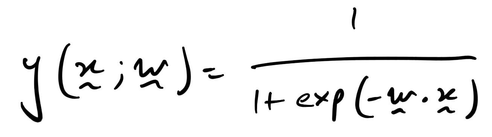
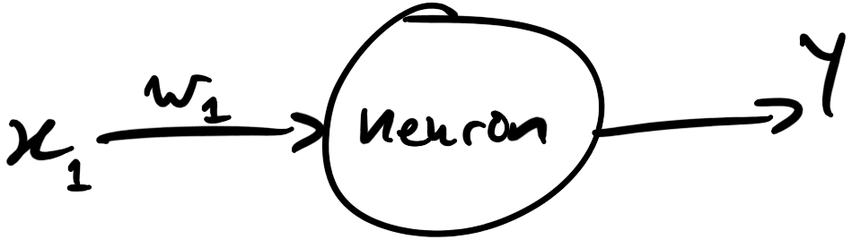
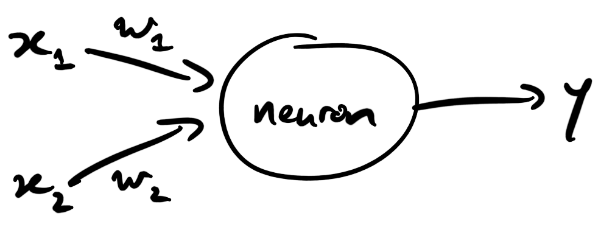
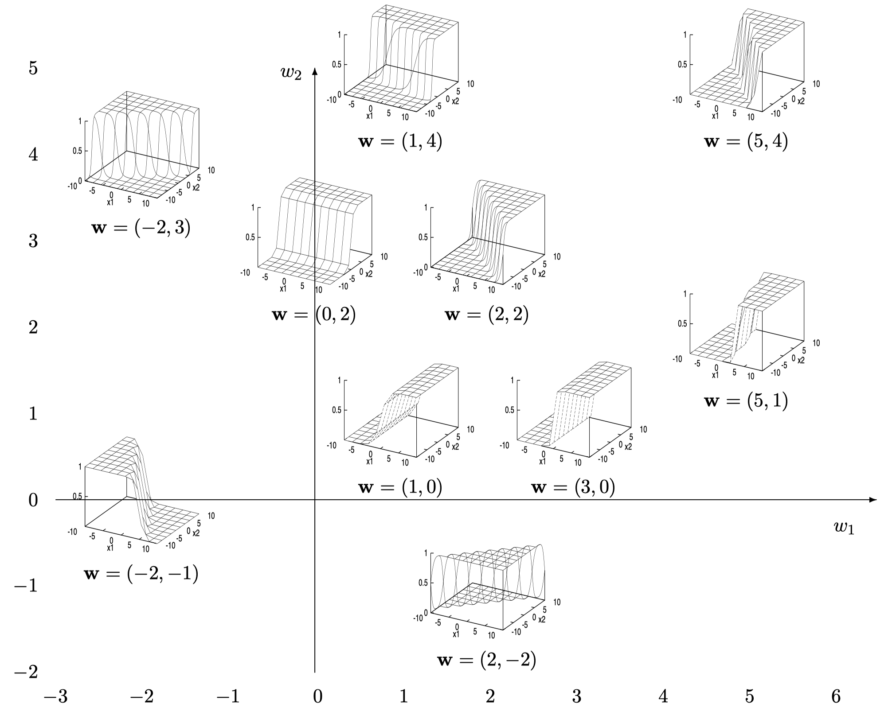
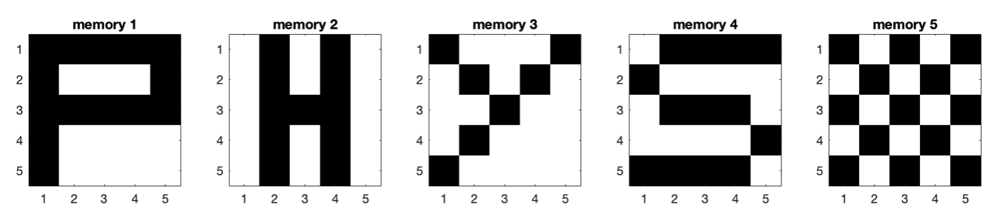
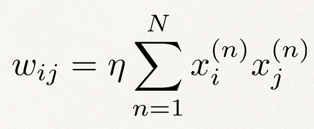
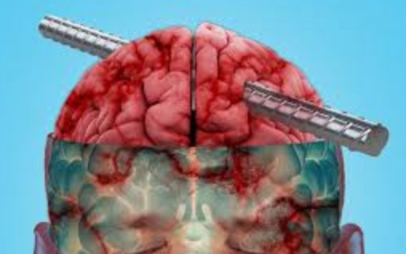

# PHYS3888 Tutorial: Building Learning Machines

In this tutorial, we'll explore two key components of this week's lectures:

1. How to train a simple model neuron to perform classification.
2. How memories can be stored in inter-connected neural networks.

## PART 1: Classification with a single neuron

### Weight space of a single neuron

Recall that we can use a sigmoidal function to map a neuron's activation to its output, `y` (we saw this in the [Tutorial for the Dynamics Module](https://github.com/PHYS3888/Tutorial_DynamicalSystems)).
So let's first get an intuition for how this mapping from a set of inputs, `x`, to an output, `y`, behaves:



Do you remember how to write inline functions (from the [Dynamics tutorial](https://github.com/PHYS3888/Tutorial_DynamicalSystems#inline-functions))?
Prove it!: write an inline function, as `y = @(x,w) ...`, that implements this nonlinear function for scalars `x` and `w`.

Make sure the function works for the convention used in this tutorial: `w` is a row vector and `x` is a column vector.

:question::question::question: __Q1:__
Check that you have implemented this function correctly by evaluating for a two-input neuron: `x = [1;-1]`, `w = [2,-1]`, as:

```matlab
x = [1; -1];
w = [2, -1];
y(x,w)
```

Submit your result to two decimal places.

Think about the computation you've just performed: you've weighted the first (positive) input, `x1 = 1` positively (`w1 = 2`), but the second (negative) input, `x2 = -1` negatively (`w2 = -1`).
Should the result of the dot product yield a positive value that yields a value near the maximum of the sigmoid (`1`), or a negative value that yields a value nearer the minimum of the sigmoid (`0`)?

Does your result match your logic?

### The one-dimensional neuron



Consider the case where our model neuron has a single input, `x`.
Then we have just a single degree of freedom in determining the neuron's response to that input, through the scalar weight, `w`.
Plot `y` as a function of `x` for some different values of the weight parameter, `w`, sampling both positive and negative values.

- What happens when `w = 0`?
- How does a higher weight magnitude shape the neuron's response to the same input?
- For the same weight magnitude, what does flipping its sign do to the neuron's response to the same input?

### The two-dimensional neuron

Ok, so we understand how setting `w` affects the response of a neuron to a single input.
Today we're going to think more about the behavior of a neuron with two inputs.
In this case, we have the freedom to set two numbers, `w = [w1,w2]`, which determine the neuron's response to its two inputs, `x = [x1,x2]`.



Each point in weight space (defined by two numbers, `w1` and `w2`), now defines a unique function of the two inputs, `x1` and `x2`.
Let's try looking at some of these possible neuron responses as a function of its inputs, at different points in weight space.



We can plot these surfaces by setting `w`, and then computing the function `y` across a grid in `x1` and `x2`.
Take a look at the function `plotNeuronResponse` and verify that you understand how it does these steps.

Then take a look at some surfaces by first setting `w` and then running `plotNeuronResponse` using the `y` function you coded above.
For example:

```matlab
w = [1,-1];
plotAsSurface = true; % turn this off if you prefer to look at a flattened image
f = figure('color','w');
plotNeuronResponse(y,w,plotAsSurface);
```

- When does the neuron tuned to `w = [1,-1]` have minimal output? Maximal output?
- If we set `w = [1,0.2]`, which of the two inputs is the neuron more sensitive to? Plot the neuron's response to inputs for this set of weights to check your intuition.

### Training a single neuron to classify inputs into two types

In lectures we found that the process of adjusting weights allows the neuron to learn a desired relationship between inputs and outputs.
We took our first steps towards the machine-learning approach of _supervised learning_, in which a flexible learning structure (like the single neuron) can learn a good input-output mapping from being exposed to a labeled training dataset.

We will consider the case where our poor neuron is forced to predict whether a person is an 'instagram model' :star2: or a 'sports star' :running:, from two pieces of information:

1. Number of instagram followers
2. Resting heart rate

Suppose we surveyed a bunch of instagram models and sports stars and assemble the data as a person x feature matrix, `dataMat`, and a binary vector, `isModel`, that labels each row as representing either a sports star (`0`) or an instagram model (`1`).

Let's load this dataset:

```matlab
load('ModelSportData.mat','dataMat','isModel')
```

Have a peek at the variables `dataMat` and `isModel` that you just loaded in.
The first column of `dataMat` is the number of instagram followers each person has, and the second column is their resting heart rate.

We can use the `scatter` function to plot the data as a scatter, coloring each individual by their `sport`/`model` label, e.g.,:

```matlab
f = figure('color','w');
scatter(dataMat(:,1),dataMat(:,2),50,isModel,'filled');
colormap(cool)
xlabel('Number of instagram followers')
ylabel('Resting heart rate')
colorbar()
```

Look at the axes.
Can you see that the number of instagram followers is on a vastly different scale to resting heart rate?

We can put them on a similar scale by applying a _z_-score transformation, which removes the mean and standardizes the variance of both features.
By defining `dataMatNorm = zscore(dataMat)`, replot the above scatter, verifying that both measurements have indeed been standardized.
Working with `dataMatNorm` allows us to interpret the relative size of `w` as relative importance scores (independent of the very different scales of the two measurements).

Now looking at the scatter using `dataMatNorm`, which of the two variables do you think will have higher weight in the trained neuron?

Remember the classification error metric, `G`, that we defined in lectures?
The computation of `G` is implemented in the function, `errorFunction`, and can be evaluated as follows:

```matlab
totalError = errorFunction(y,w,dataMatNorm,isModel);
```

In our case, we have `y` (the input/output mapping), `dataMatNorm` (the normalized input data), and `isModel` (the labeling we want to learn).
We want to understand which weight values, `w`, yield minimal errors (and check whether this matches our reasoning above).

:question::question::question: __Q2:__
At each of 100 random values of `w`, compute the classification error using `errorFunction`, and plot this value as color in a `scatter` plot in `w1,w2` space.
Take your samples from the matrix `wRand = 2*(rand(100,2)-0.5);`.
Where in `(w1,w2)` space are you getting low errors?
Does this make sense given what you know about which of the two inputs are informative of models versus sports stars?
Upload your plot (labeling axes and showing the colorbar).

### Learning from data through incremental updating

Recall from the lecture that, from a given starting point, we can move through weight space along the direction of maximal decrease in the error function, `G`.
This guides us to iteratively improve our classification performance and is in general more efficient in finding high-performing weights than the random sampling we tried above.

Let's see if our neuron can learn the difference between the two types of people by iteratively adjusting weights to reduce the error, `G` :grinning:

In the function `IncrementalUpdate`, there is a simple implementation of incremental weight updating.
For a single point of data, and a given point in weight space, IncrementalUpdate` evaluates the weight-space gradients, and uses the learning rule (from lectures) to adjust the weights.
To test the behavior of this rule, we will randomly sample observations in the dataset over and over, and see if this strategy yields a single neuron with a good ability to map the two inputs to our desired output.


Inspect the equations above, adapted from those introduced in lectures to the form of an update in response to a new data point, `xj` (with label `t`).

- How much are the weights adjusted when the neuron makes a prediction, `y`, equal to the sample's actual label, `t`?
- What happens when we increase the learning rate, `eta`?

Try starting the weights somewhere that you know is a bad place to start so that we can investigate whether the learning rule above moves us to a good set of weights:

```matlab
% Set a learning rate:
eta = ;
% Set an initial point in weight space:
w0 = ;
numIterations = 100; % total number of updates
delayTime = 1; % wait delayTime seconds between plotting each update
IncrementalUpdate(y,dataMatNorm,isModel,eta,w0,numIterations,delayTime);
```

What is being plotted? Inspect the code in `IncrementalUpdate` if you are unsure.

Check your understanding by answering the following questions:

- Where in weight space did the neuron end up?
- Did the neuron get more accurate?
- Between the two variables, what characteristic of the individuals did the neuron learn to pay more attention to?
- How does the width of the decision boundary vary over time? Does the neuron get 'more confident'?

:question::question::question: __Q3:__
Test three learning rates: `eta = 0.02`, `eta = 2`, and `eta = 200` (using initial weights `w0 = [-1,-1]` and `numIterations = 100`).
Which of these three learning rates gives an accurate and stable final result within the 100 weight-update iterations?

## PART 2: Storing Memories in Hopfield Networks

Recall how a simple Hebbian learning mechanism can allow memories to be stored in networks of connected neurons.
Networks that update weights using a Hebbian learning rule are called Hopfield Networks.

In this tutorial, we're going to attempt to store a total of five memories: the four letters `P`, `H`, `Y`, `S`, and a checkerboard :checkered_flag:, into a binary Hopfield network.
Exciting, huh? :satisfied:

So that our network can code for the five desired images, we're going to make each neuron be a pixel in 5 x 5 grid, so we'll have a total of 25 neurons in our network.
Recall that in a binary Hopfield network, each neuron's state is either `-1` (inactive) or `1` (active).

### Defining memories

Our first step is to define the memories on our 5 x 5 grid, which we will implement in the function `defineMemories`.
Plot each of our desired memories, `'P'`, `'H'`, `'Y'`, `'S'`, and `'checker'`, using the `defineMemories` function.



Do you see how the state of the 25 neurons in this network can be used to represent useful information?
Cute, huh? :smirk:

The `defineMemories` function outputs a 25 x 1 vector (a stretched-out version of the 5 x 5 grid) that defines the pixels to turn on to write out a given memory, e.g., `memory_P = defineMemories('P',true)`.
(The second input to this function determines whether to plot the pixels arranged in a 5 x 5 grid, which helps for visualization).

You can see how the 5 x 5 grid is indexed by running:

```matlab
reshape(1:25,5,5)
```

Looping over the `defineMemories` function for `'P'`,`'H'`,`'Y'`,`'S'`, and `'checker'`, __fill in the blanks (`...`)__ of the code template below to represent our five desired memories in a neuron x memory (25 x 5) matrix, `memoryMatrix`:

```matlab
theMemories = {'P','H','Y','S','checker'};
numNeurons = 25;
numMemories = 5;
memoryMatrix = zeros(numNeurons,numMemories);
for i = 1:numMemories
    memoryMatrix(...) = defineMemories(...);
end
```

### Training a Hopfield network

Ok, so now we have our memories specified in `memoryMatrix`.
Now let's train a Hopfield network with a Hebbian learning rule to try to store them.

Stare at the Hebbian learning rule for setting weights between pairs of neurons for a bit until your brain is satisfied that it can be implemented as a matrix multiplication of the memories with themselves (`memoryMatrix`).



This simple step is implemented in `trainHopfieldWeights`, so we can simply compute our weights, `w`, as:

```matlab
w = trainHopfieldWeights(memoryMatrix);
```

Run this function and then take a look at the weights you've just trained, by printing them to the command window, and visualizing them using `PlotWeightMatrix(w)`.
Pretty, right? :heart_eyes:

### Inspecting network weights

Our Hebbian rule is designed to 'wire together' neurons that 'fire together'.
That is, pixels that tend to be on together (or off together) across the memories should now be connected by strong weights.

Let's check whether this actually happened.

Take another look at the memories we're trying to store, displayed as a 5 x 5 grid, with the neuron indices labeled in red:

```matlab
InspectMemories
```

Looking across the five memories, note down neuron indexes for:

1. Two neurons that tend to be on together (or off together).
2. Two neurons that tend to be anti-correlated (when one is on the other is off and vice versa).
3. Two neurons with no particular synchronization.

For each of these four pairs, predict what the weight will be in the trained Hopfield network: (i) a high positive weight, (ii) a high negative weight, or (iii) a near-zero weight.

- Test your intuition by checking the corresponding trained weights in `w`.
- Do the values of `w` capture the patterns in the memories?

#### The strongest weights

You can threshold the weights, e.g., as `wStrong = (w > t)`, for some threshold `t`.
This allows you to construct a binary adjacency matrix, `wStrong`, that removes all weights less than the threshold `t`.
Recall from the first lecture that you can convert a binary adjacency matrix to a graph as `G = graph(A)` and plot it as `p = plot(G)`.

Using these techniques, plot a graph containing just the strongest neuron-neuron weights by setting a sensible threshold on `w`.
Can you make sense of the most strongly connected groups of neurons, given the memories that you defined?

Repeat for the most strongly negatively correlated pairs of neurons.

:question::question::question: __Q4:__
Which set of four neurons have states that are most strongly correlated to each other across the five memories?

### Exploring stable states

Ok, so we have trained a binary Hopfield network with five memories, yielding the trained weights, `w`.
And even better: we now understand what the network weights represent.
Now comes the time to test the network's performance in reproducing all of these beautiful memories.

We're going to look at some of the stable states of the trained network by feeding it lots of random initial states and seeing what sorts of states the network settles down to (hopefully it can reproduce some of our memories :pray:).

To explore the behavior of the trained network, we're going to use the `runHopfield(w,startPoint)`.

___`runHopfield` simulates the network dynamics, determined by activation rule of individual neurons, and outputs the state of the network when it reaches equilibrium.___

Fill in code below to set a random starting point (e.g., `defineMemories` has a `'random'` setting), and inspect the types of equilibrium states the trained network has:

```matlab
numRepeats = 30;
f = figure('color','w');
for i = 1:numRepeats
    startPoint = ; % FILL IN A RANDOM MEMORY
    [finalPoint,numIters] = runHopfield(w,startPoint);
    subplot(5,6,i);
    imagesc(reshape(finalPoint,5,5));
    axis('square')
    colormap(flipud(gray))
end
```

Armed with such simple rules, how did our little neural network do?

- What sort of stable states did you find?
- Do any of them resemble the memories that we've been trying to store?
- Did you find any stable states that are inverses of your memories? Why might this happen?

### Restoring memories

Let's test whether the network can do some basic error correction.
We will start our trained network near one of our memories, then corrupt a random neuron's state.
Our hope is that the network dynamics will self-correct that corrupted neural state back to one of our desired memories.

Most of the work is done for you in the `memoryRestore` function, but ___it won't work unless you first open the `flipALittle` function and complete the missing code that flips the state of a random neuron___.

```matlab
startNearMemoryNumber = 5; % start at the checkerboard
memoryRestore(memoryMatrix,w,startNearMemoryNumber)
```

How did the network do?
Repeat the exercise for all of the other memories by altering `startNearMemoryNumber`.

:question::question::question: __Q5:__
Are some memories easier to restore than others?
Why might this be?

### Brain damage

_How robust is the network to some damage?_

Imagine opening up your smartphone or phablet and pulling out some of the connections between its components :hammer:.
How many do you think you could destroy before your phone would stop working?

What about for our Hopfield network?
What is your guess of the proportion of network weights that can be set to zero before the network's function breaks down.
Write it down! :memo:

<!--  -->

Check out the function, `brainDamage`:

```matlab
wCorrupted = brainDamage(w,propCorrupt);
```

This function takes as input a trained weight matrix, `w`, and outputs `wCorrupted`, a version where a set proportion of weights, `propCorrupt`, have been randomly set to zero.
For example, setting `propCorrupt = 0.1` sets 10% of the weights to zero.

Repeat the above exercise on memory restoration, but using a corrupted network defined by `wCorrupted` (instead of the original network defined by `w`).
_Don't forget you can visualize corrupted network weights as_ `PlotWeightMatrix(wCorrupted)`

Qualitatively explore the robustness of the memory restoration capability as a function of the proportion of weights you set to zero.

:question::question::question: __Q6:__
At approximately what proportion, `propCorrupt`, does the network cease to have useful function?

- How does this compare to a computer circuit?
- How close was your original guess?

---

## Extra exercises for neural network lovers

### :fire::fire::fire: (Optional): Quantifying performance breakdown

For each value of `propCorrupt`, quantify the associative memory performance, `meanMatch`, of the network by the average proportion of neurons that don't match the desired state.
Summarize the network's performance as `meanMatch` as a function of `propCorrupt`.
How do these curves vary with the target memory to be restored?

### :fire::fire::fire: (Optional): An overloaded network

How many memories can we squeeze into our 25-neuron network?

Repeat the above, adding new memories (e.g., by adding new cases to `defineMemories`), and see how an overloaded network can affect the stability of our desired memories.
Are different sets of memories more amenable to storage than others?

### :fire::fire::fire: (Optional): Solidifying

Try duplicating some of the memories (e.g., multiple `'P'`s).
What do you think that such a duplication would do to the behavior of the network?

### :fire::fire::fire: (Optional): Bigger is better

Try storing equivalent versions of the same five memories in a bigger network (e.g., in an 8x8 grid).
Does the network display better performance?

### :fire::fire::fire::fire::fire: (Optional): Improving on Hebb

In lectures we recast the problem such that memories define a classification problem for each neuron.

This suggests that we can recast each neuron's state as a classification problem in response to the state of the other neurons, and thus use the weight-update rule that we investigated above.

Using the Hebbian-trained network weights as a starting point, see if you can implement single neuron weight-update learning rules to improve network performance in restoring memories.

Are the weight changes focused on any particular neurons?
Why might this be the case?
